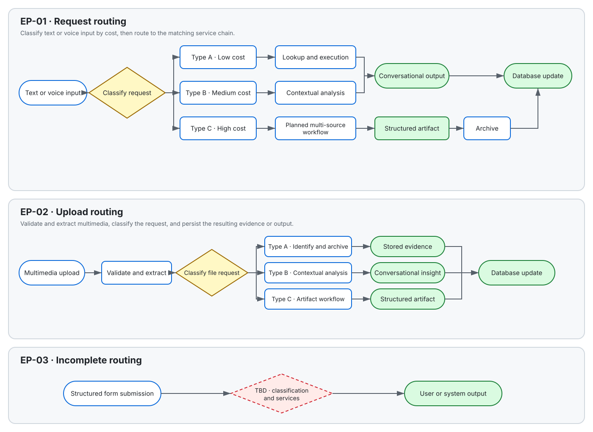
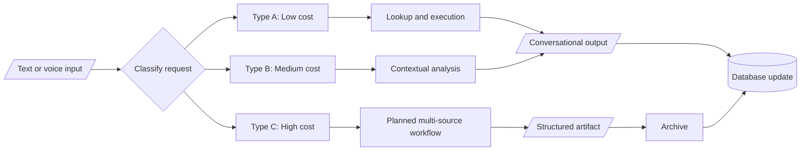
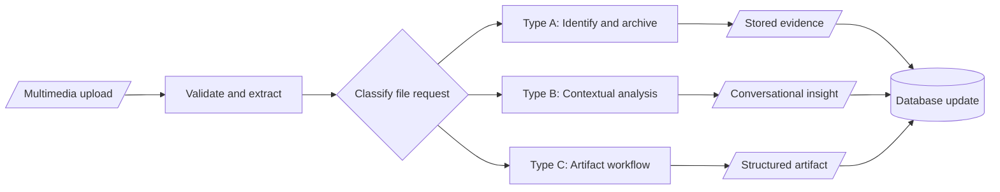
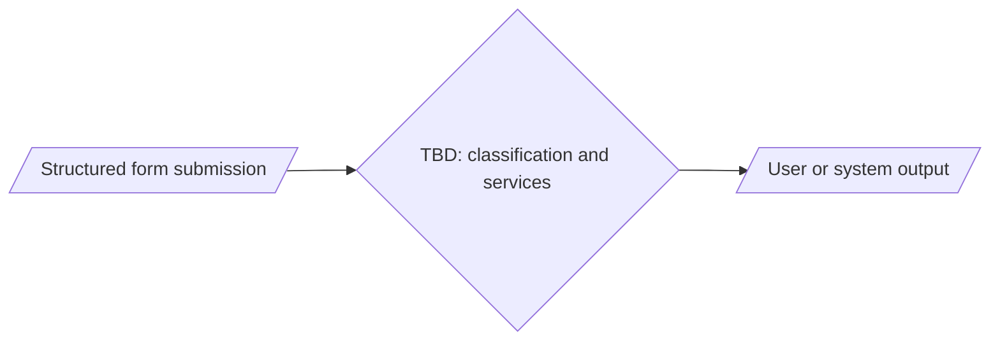

# Topogrow — IO Flow Specification

## Purpose and Scope

This document standardizes Topogrow's parent-facing interaction and orchestration flows for cross-functional review and implementation planning. It covers natural-language or voice interaction, multimedia upload, and the partially specified structured-form entry point found in the source.

The document preserves the source's service order and classification intent. It does not define authentication, authorization, privacy controls, retry behavior, failure branches, service-level objectives beyond stated response targets, or implementation ownership where the source is silent.

## Classification Defaults

There is no universal classification threshold across all entry points. Each entry point defines its own classification basis:

- `EP-01` uses information density, reasoning depth, historical context, background execution, artifact generation, and response time.
- `EP-02` uses file count, historical or cross-record analysis, workflow duration, and artifact generation.
- `EP-03` has no classification definition in the source and remains unresolved.

When a request matches more than one type, selecting the highest-cost matching type is a draft standardization assumption pending `OD-01`.

## Progress Overview

| ID | Entry Point | Types | Status | Owner | Last Updated | Open Items |
|---|---|---|---|---|---|---|
| EP-01 | Main Interaction Text Box / Chat Area | A, B, C | draft | unspecified | 2026-09-01 | 4 |
| EP-02 | Multimedia Upload | A, B, C | draft | unspecified | 2026-09-01 | 4 |
| EP-03 | Structured Form | TBD | draft | unspecified | 2026-09-01 | 2 |

## Entry Points

### EP-01 — Main Interaction Text Box / Chat Area

| Field | Value |
|---|---|
| Location | Dashboard (optional) Main Menu (mini) Mobile Web App landing Dedicated page |
| Function | Allow parents to record, retrieve, and analyze information; receive guidance; and initiate platform workflows through natural-language conversations. |
| Trigger / Input | Parent text or voice request. |
| Expected Output | Conversational information, analysis, guidance, a structured artifact, or an initiated platform workflow, depending on type. |
| Status | draft |
| Owner | unspecified |

**Classification Basis**

Classify by information density, historical or multi-source context, reasoning and planning depth, background duration, whether a standalone artifact is generated, and the expected response window. Type A targets under 5 seconds, Type B targets 5–30 seconds, and Type C may take several minutes or be queued; the precise Type C service level remains unresolved in `OD-02`.

#### Type A — Low-Cost Input

**Definition**

- Produces a low-information-density result.
- Retrieves or looks up information without complex analysis.
- Does not require a long-running background task.
- Targets a response time under 5 seconds.

**Examples**

- Ask for the weather forecast on the day of an exam taking place in three days.
- Ask for the estimated driving time to tomorrow's soccer game.
- Recall information recorded yesterday.

**Loop**

Text / Voice Input → IR Service → Task Distribution Service → Execution Service → Verification Service → Output → Database Update

#### Type B — Medium-Cost Input

**Definition**

- Requires historical data retrieval and contextual understanding.
- Analyzes multiple records or data sources.
- May detect trends, recognize patterns, or generate personalized insights.
- Presents results directly in the conversation without a standalone report or document.
- Targets a response time of 5–30 seconds.

**Examples**

- Analyze the child's sleep patterns over the past week.
- Identify strengths observed from recent records.
- Explore why the child has recently been reluctant to attend school.

**Loop**

Text / Voice Input → IR Service → Pre-Analysis → Task Distribution Service → Execution Service → Database → Data Cleaning & Structuring → Analysis / Insight Generation → Verification Service → Output → Database Update

#### Type C — High-Cost Input

**Definition**

- Requires multi-step reasoning and planning.
- May use multiple data sources, documents, and historical records.
- May trigger a long-running or queued background process.
- Generates a structured output, report, plan, or downloadable artifact.
- May require orchestration across multiple AI agents and system services.
- Has an expected response measured in several minutes or a queued workflow; a measurable target is not yet defined.

**Examples**

- Create a personalized university pathway and long-term education plan.
- Summarize the child's major developmental milestones from the past year.
- Produce a detailed action plan for ongoing behavioral or learning challenges.

**Loop**

Text / Voice Input → IR Service → Pre-Analysis → Task Planning Service → Execution Service → Database → Data Cleaning & Structuring → Multi-Source Analysis / Insight Generation → Artifact Generation Service → Verification Service → Output → Archive Service → Database Update

### EP-02 — Multimedia Upload

| Field | Value |
|---|---|
| Location | Dashboard (optional) Mobile Web App landing Dedicated page |
| Function | Allow parents to upload images, videos, school or assessment reports, certificates, artwork, and other files; extract and structure information; link evidence to the child profile; and optionally generate insights, reports, or recommendations. |
| Trigger / Input | One or more images, videos, PDFs, Word documents, school reports, or related files. |
| Expected Output | Validated and stored evidence, structured memories, conversational insights, or a generated artifact, depending on type. |
| Status | draft |
| Owner | unspecified |

**Classification Basis**

Classify by file count, whether historical or cross-record context is required, analysis depth, workflow duration, and whether the request produces a standalone artifact. Only Type A has a source-defined response target; Type B and Type C thresholds remain unresolved in `OD-03`.

#### Type A — Identify and Archive / Low-Cost File Processing

**Definition**

- Processes a single file.
- Requires no historical analysis or cross-record reasoning.
- Extracts, classifies, and stores information as the primary outcome.
- Targets a response time under 10 seconds.

**Examples**

- Upload a school report card and update the database for future tracking.
- Scan and upload a child's artwork for classification and evidence storage.

**Loop**

File Upload → File Validation Service → Content Extraction Service (OCR / Speech-to-Text / Metadata) → Classification Service → Memory Atom Generation → Verification Service → Evidence Storage Service → Output → Database Update

#### Type B — Contextual / Medium-Cost File Analysis

**Definition**

- Requires historical context.
- Compares records, detects trends, or interprets the uploaded material.
- Generates insights directly in the conversation.
- Does not produce a standalone report.

**Examples**

- Upload a psychoeducational assessment and ask what it means.
- Upload three report cards and ask about trends.
- Upload school comments and ask for the key concerns.
- Upload artwork and compare it with previous work.

**Loop**

File Upload → File Validation Service → Content Extraction Service → Classification Service → Context Retrieval Service → Task Distribution Service → Execution Service → Database → Data Cleaning & Structuring → Cross-Source Analysis → Insight Generation → Verification Service → Output → Database Update

#### Type C — Comprehensive File / Artifact Generation

**Definition**

- Uses multi-source reasoning.
- Runs as a long-duration workflow.
- Generates a structured artifact.
- May trigger multiple AI agents.

**Examples**

- Upload a psychoeducational assessment, report cards, and an IEP, then request a university pathway plan.
- Upload one year of school reports and request a yearly growth summary.
- Upload a complete learning portfolio and request educational recommendations.

**Loop**

File Upload → File Validation Service → Content Extraction Service → Knowledge Structuring Service → Context Retrieval Service → Task Planning Service → Workflow Orchestration Service → Execution Service → Database → Multi-Source Analysis → Artifact Generation Service → Verification Service → Archive Service → Output → Database Update

### EP-03 — Structured Form

| Field | Value |
|---|---|
| Location | Dashboard Dedicated page |
| Function | [TBD: Define the structured form's product purpose — product owner] |
| Trigger / Input | [TBD: Define form variants, fields, submission trigger, and validation requirements — product owner] |
| Expected Output | [TBD: Define the user-visible result and persisted system outcome — product owner] |
| Status | draft |
| Owner | unspecified |

**Classification Basis**

[TBD: Define whether structured-form submissions are classified by validation complexity, data sensitivity, workflow cost, artifact generation, or another entry-specific dimension — product owner]

#### Type TBD — Classification Pending

**Definition**

[TBD: Define the request types and mutually distinguishable routing criteria — product owner]

**Examples**

- [TBD: Add representative structured-form submissions and boundary examples — product owner]

**Loop**

Structured Form Submission → [TBD: Define validation, routing, execution, and persistence services — engineering owner] → User / System Output

## Flow Visualizations

The detailed loops above are authoritative. These diagrams provide a compact routing projection for review and do not add services or decisions.

The SVG above is the portable display version. The source blocks below remain editable and can be opened in Mermaid Live Editor.

### Visualization — `EP-01` request routing

### Visualization — `EP-02` upload routing

### Visualization — `EP-03` incomplete routing

## Open Decisions and Assumptions

| ID | Entry / Type | Kind | Question or Assumption | Owner | Blocking | Target Date |
|---|---|---|---|---|---|---|
| OD-01 | EP-01 / EP-02 | assumption | When criteria overlap, route to the highest-cost matching type. Confirm or replace this precedence rule. | unspecified | yes | unspecified |
| OD-02 | EP-01 / Type C | question | What measurable response or queue SLA replaces "several minutes or queued"? | unspecified | no | unspecified |
| OD-03 | EP-02 / Types B-C | question | What response-time or queue thresholds distinguish medium- and high-cost file workflows? | unspecified | no | unspecified |
| OD-04 | EP-01 / EP-02 | question | Are `Database` and `Database Update` separate synchronous services, and which persistence/archive steps are asynchronous? | unspecified | yes | unspecified |
| OD-05 | EP-03 | question | Define the structured form's function, inputs, outputs, classification, examples, and service loops. | unspecified | yes | unspecified |
| OD-06 | All | question | Who owns each entry point, and what evidence is required to advance it to `in_review`, `confirmed`, or `implemented`? | unspecified | no | unspecified |

## Change Log

| Version | Date | Author | Scope | Change | Rationale / Source |
|---|---|---|---|---|---|
| 0.1.1 | 2026-09-01 | Codex | visualization / localization | Added synchronized Mermaid routing views, language metadata, and the linked Simplified Chinese companion. | User-requested visualization and English/Chinese support |
| 0.1.0 | 2026-09-01 | Codex | initial | Standardized the supplied Topogrow flow into the lifecycle schema; preserved incomplete EP-03 content as explicit TBDs. | Topogrow-IO Flow.md |
