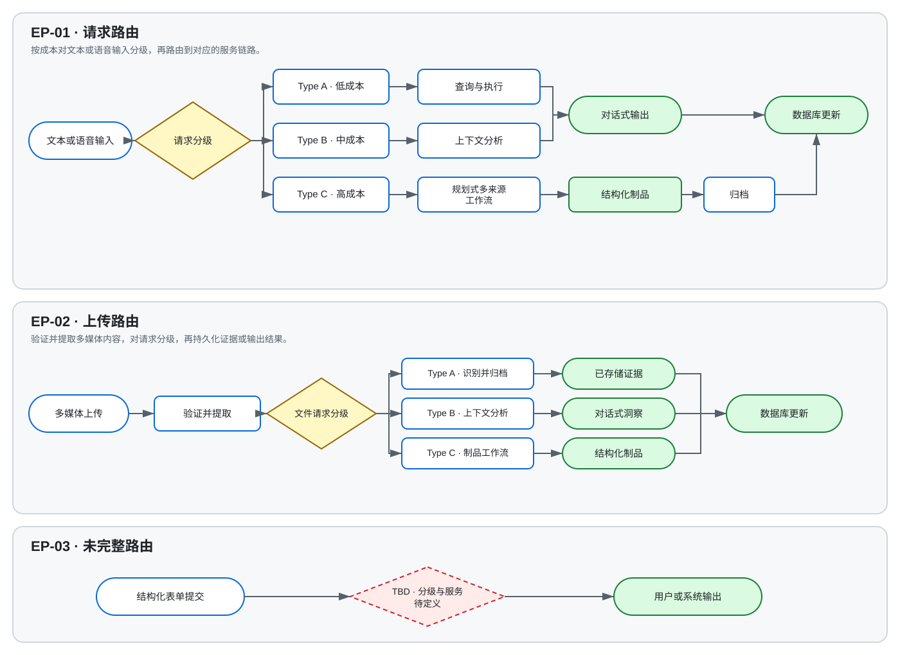
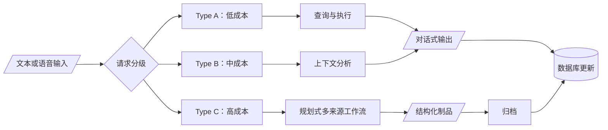
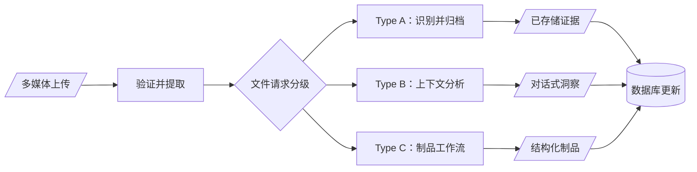
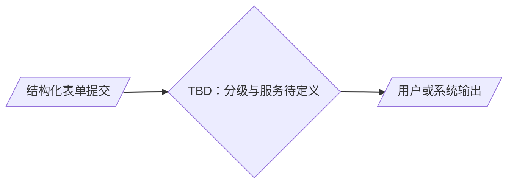

# Topogrow — IO Flow 规格书

## 目的与范围

本文档对 Topogrow 面向家长的交互与编排流程进行标准化，供跨职能评审与实施规划使用。范围包括自然语言或语音交互、多媒体上传，以及来源文档中仅有部分定义的结构化表单入口。

本文保留来源文档中的服务顺序与分级意图。对于来源未说明的认证、授权、隐私控制、重试行为、失败分支、已声明响应目标之外的服务级目标，以及实施负责人，本文不作定义。

## 默认分级规则

所有入口点之间不存在统一的分级阈值。每个入口点分别定义自己的分级依据：

- `EP-01` 依据结果信息密度、推理深度、历史上下文、后台执行、制品生成与响应时间进行分级。
- `EP-02` 依据文件数量、是否需要历史或跨记录分析、工作流时长与制品生成进行分级。
- `EP-03` 在来源文档中没有分级定义，因此保持待确认状态。

当一个请求同时满足多个类型时，暂按成本最高的匹配类型路由；该规则是待 `OD-01` 确认的标准化假设。

## 进度总览

| ID | 入口点 | 类型 | 状态 | 负责人 | 最后更新 | 待确认项 |
|---|---|---|---|---|---|---|
| EP-01 | 主交互文本框 / 聊天区域 | A, B, C | draft | unspecified | 2026-09-01 | 4 |
| EP-02 | 多媒体上传 | A, B, C | draft | unspecified | 2026-09-01 | 4 |
| EP-03 | 结构化表单 | TBD | draft | unspecified | 2026-09-01 | 2 |

## 入口点

### EP-01 — 主交互文本框 / 聊天区域

| 字段 | 值 |
|---|---|
| 位置 | Dashboard（可选） 主菜单（mini） 移动 Web App 首页 独立页面 |
| 功能 | 让家长通过自然语言对话记录、检索和分析信息，获取指导，并启动平台工作流。 |
| 触发 / 输入 | 家长提交的文本或语音请求。 |
| 预期输出 | 根据类型产生对话式信息、分析、指导、结构化制品，或启动平台工作流。 |
| 状态 | draft |
| 负责人 | unspecified |

**分级标准**

依据结果信息密度、是否需要历史或多来源上下文、推理与规划深度、后台执行时长、是否生成独立制品，以及预期响应窗口进行分级。Type A 的目标为 5 秒以内，Type B 为 5–30 秒，Type C 可能需要数分钟或进入队列；Type C 的精确服务水平仍在 `OD-02` 中待确认。

#### Type A — 低成本输入

**定义**

- 产生低信息密度的结果。
- 仅检索或查询信息，不需要复杂分析。
- 不需要长时间运行的后台任务。
- 目标响应时间为 5 秒以内。

**示例**

- 查询三天后考试当天的天气预报。
- 查询明天足球比赛地点的预计驾车时间。
- 回顾昨天记录的信息。

**处理链路**

文本 / 语音输入 → 信息检索服务（IR Service） → 任务分发服务（Task Distribution Service） → 执行服务（Execution Service） → 验证服务（Verification Service） → 输出 → 数据库更新（Database Update）

#### Type B — 中成本输入

**定义**

- 需要检索历史数据并理解上下文。
- 分析多条记录或多个数据来源。
- 可能检测趋势、识别模式或生成个性化洞察。
- 结果直接在对话中呈现，不生成独立报告或文档。
- 目标响应时间为 5–30 秒。

**示例**

- 分析孩子过去一周的睡眠模式。
- 从近期记录中识别孩子表现出的优势。
- 探索孩子最近不愿上学的原因。

**处理链路**

文本 / 语音输入 → 信息检索服务（IR Service） → 预分析（Pre-Analysis） → 任务分发服务（Task Distribution Service） → 执行服务（Execution Service） → 数据库（Database） → 数据清洗与结构化（Data Cleaning & Structuring） → 分析 / 洞察生成（Analysis / Insight Generation） → 验证服务（Verification Service） → 输出 → 数据库更新（Database Update）

#### Type C — 高成本输入

**定义**

- 需要多步推理与规划。
- 可能使用多个数据来源、文档与历史记录。
- 可能触发长时间运行或排队的后台流程。
- 生成结构化输出、报告、计划或可下载制品。
- 可能需要多个 AI agent 与系统服务协同编排。
- 预期响应以数分钟计，或进入队列工作流；目前尚无可量化目标。

**示例**

- 创建个性化的大学路径与长期教育计划。
- 总结孩子过去一年的主要发展里程碑。
- 针对持续的行为或学习挑战生成详细行动计划。

**处理链路**

文本 / 语音输入 → 信息检索服务（IR Service） → 预分析（Pre-Analysis） → 任务规划服务（Task Planning Service） → 执行服务（Execution Service） → 数据库（Database） → 数据清洗与结构化（Data Cleaning & Structuring） → 多来源分析 / 洞察生成（Multi-Source Analysis / Insight Generation） → 制品生成服务（Artifact Generation Service） → 验证服务（Verification Service） → 输出 → 归档服务（Archive Service） → 数据库更新（Database Update）

### EP-02 — 多媒体上传

| 字段 | 值 |
|---|---|
| 位置 | Dashboard（可选） 移动 Web App 首页 独立页面 |
| 功能 | 让家长上传图片、视频、学校或评估报告、证书、作品及其他文件；提取并结构化信息；将证据关联到孩子档案；并按需生成洞察、报告或建议。 |
| 触发 / 输入 | 一张或多张图片、视频、PDF、Word 文档、学校报告或相关文件。 |
| 预期输出 | 根据类型产生已验证并保存的证据、结构化记忆、对话式洞察或生成的制品。 |
| 状态 | draft |
| 负责人 | unspecified |

**分级标准**

依据文件数量、是否需要历史或跨记录上下文、分析深度、工作流时长，以及请求是否生成独立制品进行分级。来源仅为 Type A 定义了响应目标；Type B 与 Type C 的阈值仍在 `OD-03` 中待确认。

#### Type A — 识别并归档 / 低成本文件处理

**定义**

- 处理单个文件。
- 不需要历史分析或跨记录推理。
- 主要结果是提取、分类并存储信息。
- 目标响应时间为 10 秒以内。

**示例**

- 上传学校成绩单并更新数据库，供后续追踪。
- 扫描并上传孩子的作品，用于分类和证据存储。

**处理链路**

文件上传 → 文件验证服务（File Validation Service） → 内容提取服务（Content Extraction Service：OCR / Speech-to-Text / Metadata） → 分类服务（Classification Service） → 记忆原子生成（Memory Atom Generation） → 验证服务（Verification Service） → 证据存储服务（Evidence Storage Service） → 输出 → 数据库更新（Database Update）

#### Type B — 上下文分析 / 中成本文件处理

**定义**

- 需要历史上下文。
- 比较记录、识别趋势或解释上传材料。
- 直接在对话中生成洞察。
- 不生成独立报告。

**示例**

- 上传心理教育评估并询问其含义。
- 上传三份成绩单并询问趋势。
- 上传学校评语并询问主要关注点。
- 上传作品并与以往作品比较。

**处理链路**

文件上传 → 文件验证服务（File Validation Service） → 内容提取服务（Content Extraction Service） → 分类服务（Classification Service） → 上下文检索服务（Context Retrieval Service） → 任务分发服务（Task Distribution Service） → 执行服务（Execution Service） → 数据库（Database） → 数据清洗与结构化（Data Cleaning & Structuring） → 跨来源分析（Cross-Source Analysis） → 洞察生成（Insight Generation） → 验证服务（Verification Service） → 输出 → 数据库更新（Database Update）

#### Type C — 综合文件 / 制品生成

**定义**

- 使用多来源推理。
- 作为长时工作流运行。
- 生成结构化制品。
- 可能触发多个 AI agent。

**示例**

- 上传心理教育评估、成绩单和 IEP，并请求大学路径计划。
- 上传一整年的学校报告，并请求年度成长总结。
- 上传完整学习档案，并请求教育建议。

**处理链路**

文件上传 → 文件验证服务（File Validation Service） → 内容提取服务（Content Extraction Service） → 知识结构化服务（Knowledge Structuring Service） → 上下文检索服务（Context Retrieval Service） → 任务规划服务（Task Planning Service） → 工作流编排服务（Workflow Orchestration Service） → 执行服务（Execution Service） → 数据库（Database） → 多来源分析（Multi-Source Analysis） → 制品生成服务（Artifact Generation Service） → 验证服务（Verification Service） → 归档服务（Archive Service） → 输出 → 数据库更新（Database Update）

### EP-03 — 结构化表单

| 字段 | 值 |
|---|---|
| 位置 | Dashboard 独立页面 |
| 功能 | [TBD: 定义结构化表单的产品目的 — 产品负责人] |
| 触发 / 输入 | [TBD: 定义表单变体、字段、提交触发条件与验证要求 — 产品负责人] |
| 预期输出 | [TBD: 定义用户可见结果与持久化系统结果 — 产品负责人] |
| 状态 | draft |
| 负责人 | unspecified |

**分级标准**

[TBD: 定义结构化表单提交是按验证复杂度、数据敏感性、工作流成本、制品生成，还是其他入口专属维度进行分级 — 产品负责人]

#### Type TBD — 分级待定义

**定义**

[TBD: 定义请求类型及可相互区分的路由标准 — 产品负责人]

**示例**

- [TBD: 添加有代表性的结构化表单提交场景与边界示例 — 产品负责人]

**处理链路**

结构化表单提交 → [TBD: 定义验证、路由、执行与持久化服务 — 工程负责人] → 用户 / 系统输出

## 流程可视化

以上详细链路是权威定义。以下图表仅提供便于评审的紧凑路由投影，不增加任何服务或决策。

以上 SVG 是可跨环境直接显示的版本。下方源码仍可编辑，也可以复制到 Mermaid Live Editor 中打开。

### 可视化 — `EP-01` 请求路由

### 可视化 — `EP-02` 上传路由

### 可视化 — `EP-03` 未完整路由

## 待确认事项与假设

| ID | 入口 / 类型 | 类别 | 问题或假设 | 负责人 | 阻塞 | 目标日期 |
|---|---|---|---|---|---|---|
| OD-01 | EP-01 / EP-02 | 假设 | 当条件重叠时，路由至成本最高的匹配类型。请确认或替换该优先级规则。 | unspecified | yes | unspecified |
| OD-02 | EP-01 / Type C | 问题 | 应使用什么可量化的响应或队列 SLA 替代“数分钟或排队”？ | unspecified | no | unspecified |
| OD-03 | EP-02 / Types B-C | 问题 | 哪些响应时间或队列阈值用于区分中成本与高成本文件工作流？ | unspecified | no | unspecified |
| OD-04 | EP-01 / EP-02 | 问题 | `Database` 与 `Database Update` 是否为两个独立同步服务？哪些持久化或归档步骤是异步的？ | unspecified | yes | unspecified |
| OD-05 | EP-03 | 问题 | 定义结构化表单的功能、输入、输出、分级、示例与服务链路。 | unspecified | yes | unspecified |
| OD-06 | 全部 | 问题 | 每个入口点由谁负责？推进到 `in_review`、`confirmed` 或 `implemented` 需要什么证据？ | unspecified | no | unspecified |

## 变更记录

| Version | Date | Author | Scope | Change | Rationale / Source |
|---|---|---|---|---|---|
| 0.1.1 | 2026-09-01 | Codex | 可视化 / 本地化 | 增加同步 Mermaid 路由视图、语言元数据，以及关联的英文版本。 | 用户要求的可视化与中英文支持 |
| 0.1.0 | 2026-09-01 | Codex | 初始版本 | 将用户提供的 Topogrow 流程标准化为生命周期 Schema；将 EP-03 的不完整内容保留为显式待确认标记。 | Topogrow-IO Flow.md |
